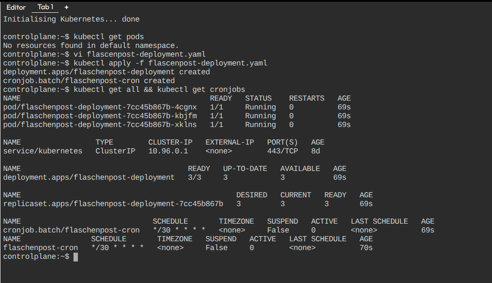
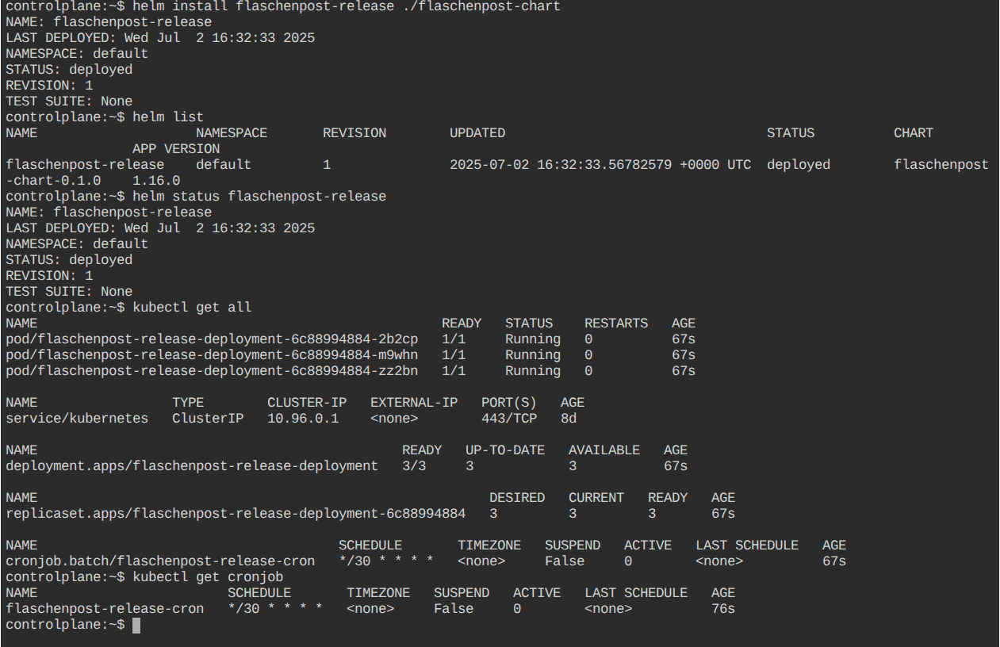

# Kubernetes Deployment and CronJob - Question 2

This repository contains Kubernetes manifests and/or Helm chart to deploy the **shop backend API** application and a CronJob to the Kubernetes cluster as per the provided requirements.

---

## Task Overview

- Deploy a **Deployment** with at least **3 replicas**.
- Each Pod runs a single container:
  - Image: `strm/helloworld-http:latest`
  - Container exposes port 80
- Configure **LivenessProbe** using TCP on port 80 with initial delay 10 seconds.
- Configure **ReadinessProbe** using HTTP GET on `/` endpoint, port 80 with:
  - initial delay 10 seconds
  - period seconds 1
  - failure threshold 2
- Set up a **CronJob** that prints `"Hello SRE"` every 30 minutes.
- Resources will be deployed in the **default namespace**.
- Deployable via `kubectl` or Helm.

---

## Contents

- `deployment.yaml` — Kubernetes Deployment and CronJob manifest file.
- `flaschenpost-chart/` (optional) — Helm chart containing the Deployment and CronJob templates.

---

## Prerequisites

- A running Kubernetes cluster (latest GA version recommended).
- `kubectl` CLI installed and configured.
- `helm` CLI installed (if using Helm deployment).

---

## Deployment Using kubectl

### Apply the Deployment and CronJob manifest:

kubectl apply -f flaschenpost-deployment.yaml

### Verify the Deployment, Pods, and CronJob:
kubectl get deployments
kubectl get pods
kubectl get cronjobs

### To delete the resources when no longer needed
kubectl delete -f flaschenpost-deployment.yaml

# Deployment Using Helm

### Navigate to the Helm chart directory:
cd flaschenpost-chart

### Install the Helm chart:
helm install flaschenpost-release .

### Check the status of the release:
helm status flaschenpost-release

### List all resources deployed by Helm release:
kubectl get all -l app.kubernetes.io/instance=flaschenpost-release
kubectl get cronjobs

### To uninstall the release:
helm uninstall flaschenpost-release

# Output
## Manifest Output

## Helm Output

