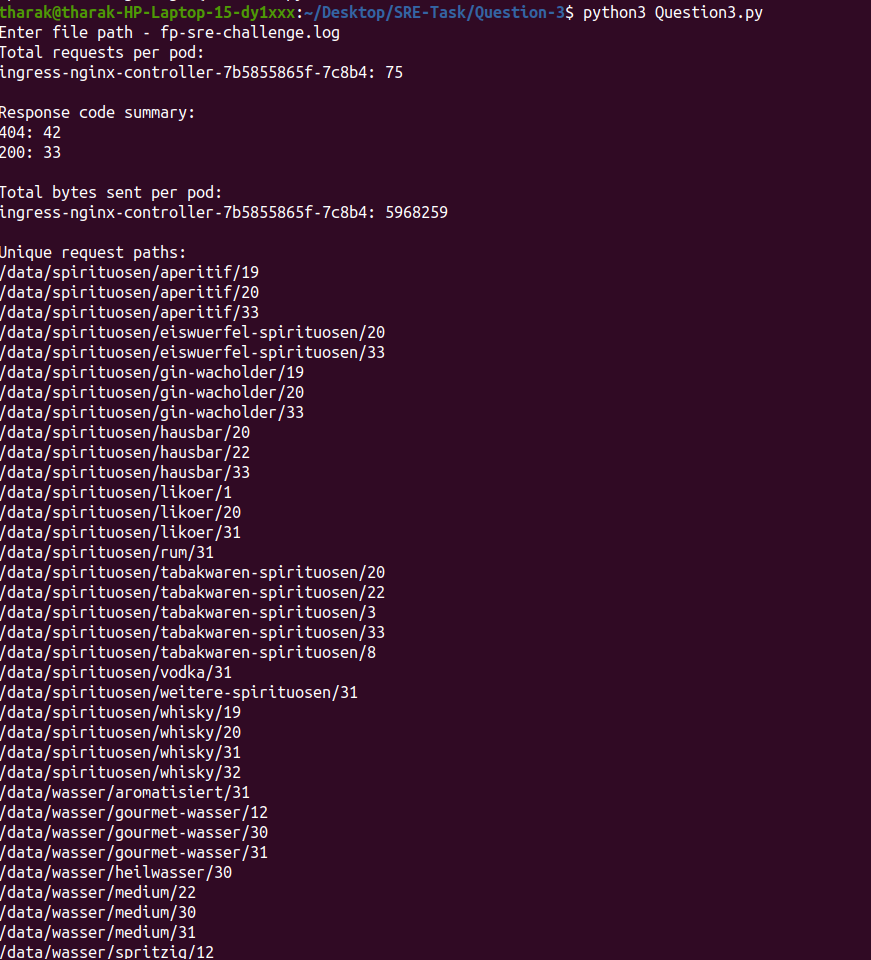

# Question3 - Log File Analyzer
This Python script analyzes an HTTP request log file to provide useful summaries about traffic handled by different pods in your infrastructure.

## Features
Counts total HTTP requests per ingress pod.

Summarizes the occurrence of each HTTP response code.

Calculates total bytes sent per pod.

Lists all unique request paths accessed.

## Requirements
Python 3.x

No external libraries needed (only built-in modules used).

## Input
Log file path

## Usage

### Run the script with Python3 
python3 Question4.py

# Output

