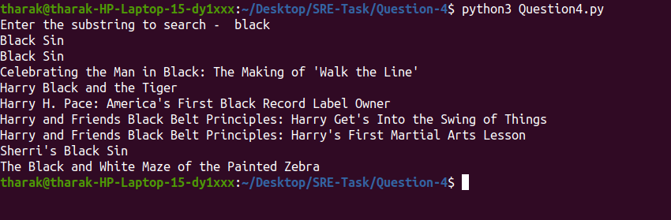

# Question-4 Movie Titles Retriever

## Description

This Python script fetches movie titles from a public API based on a search substring. It handles pagination, collects all titles, sorts them alphabetically, and outputs the sorted list.
### Extra Feature Added - it doesn't print duplicate values
## Requirements

- Python 3.x
- `requests` library (`pip install requests`)

## Usage

### Run the script:
python Question4.py

### Enter the substring when prompted.

The script will display the sorted list of matching movie titles or a message if no movies are found.
### Example

# Output

